# クラス図を作成に使用したMermaidについて
 * https://zenn.dev/tak_uchida/articles/da583cf960e854

# 大体の動き
```cpp
main(int argc, char *argv[])
{
	if (argc != 3)
		return (1); // エラーメッセージ

	try {
		Config config(argv[1], argv[2]); // port, password, etc...
		SessionManager sessionManager();
		ChannelManager channelManager()
		IRCServer server(config, channelManager, sessionManager); // ポリモーフィズムのために参照渡しすること。
	
		IRCObserver observer();
		observer.addEventListener(server);
		observer.startObserve(); // ここに入ったらもうエラーでは終了しないこと。
	}
	catch (const std::exception& e) {
		std::cerr << e.what() << std::endl;
		return (1);
	}
	return (0);
}
```

# 全体
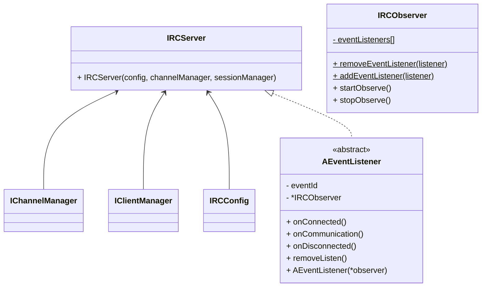

# IRCConfig - 設定
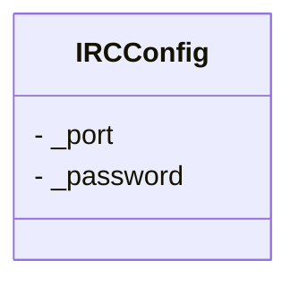

# IClientManager - クライアントマネージャー
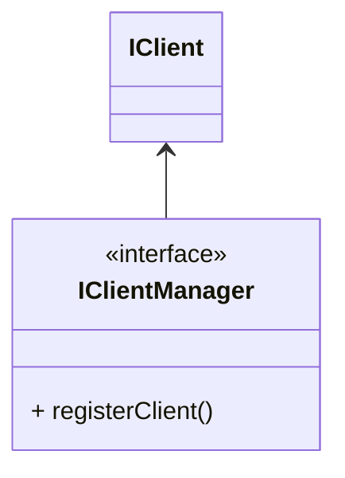

# IClient - クライアント
サーバー・クライアント
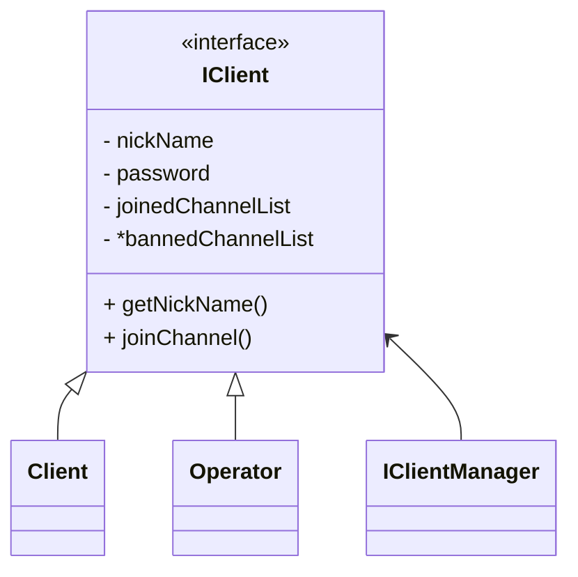

# IEventListener - イベント処理
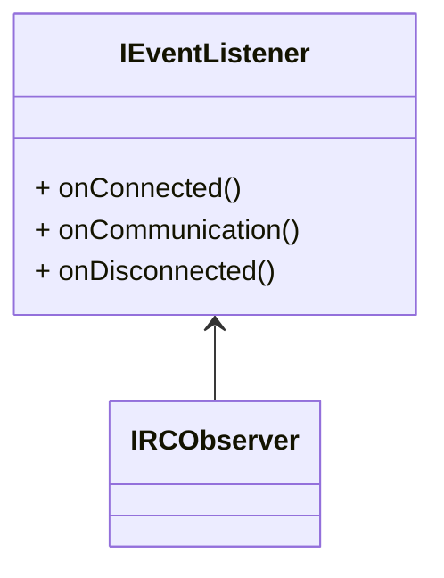

# Session - セッション
ソケット通信における接続を以下のようにセッションとして定義する。
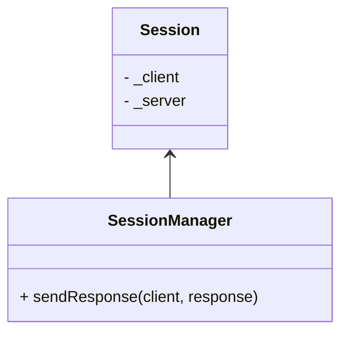

# IChannel - チャンネル
チャンネル
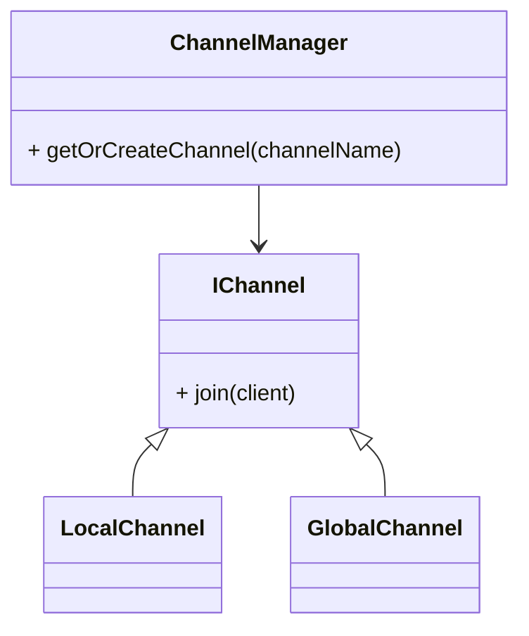

# Request - リクエスト
リクエスト
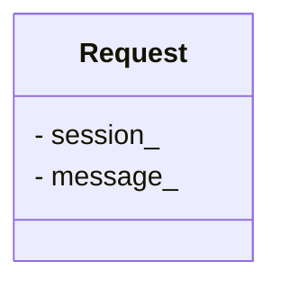
# ICommand - コマンド
コマンドに関する処理
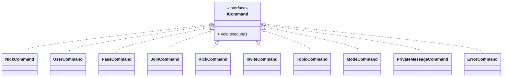

# CommandFactory  - コマンド生成
コマンド生成に関する処理。parser
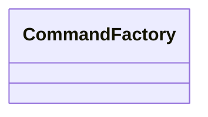

# Logger
ログに関する処理
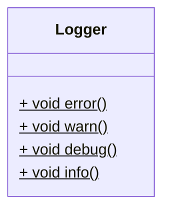

# ANumericReply
各リプライクラスを定義する。
これらは必要になったときに作ること。
コンストラクタで必要な情報をそれぞれ渡す。
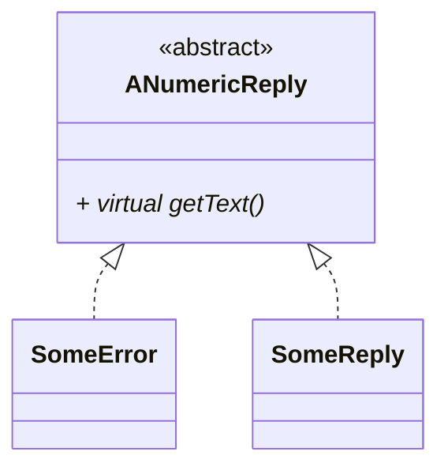

# Response
送信先の設定、送信元の設定が可能にする。
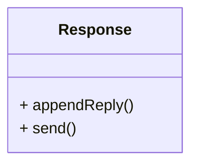

# 
